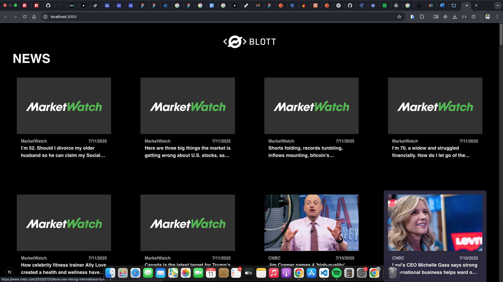

# Finance Digest 📰

Finance Digest is a responsive news aggregation web app built with **Next.js 15**, **Typescript** and **Tailwind CSS**. It fetches real-time finance news from the [Finnhub API](https://finnhub.io/docs/api/market-news) and displays them in a clean, modern UI inspired by a provided Figma design.

> Built for a Web Assessment Test by **Saviour Promise**

## 🚀 Features

- 🔥 Real-time finance news (category: General)
- 📱 Fully responsive design (mobile-first)
- 🎨 Matches provided Figma UI pixel-perfectly
- 🌗 Light/Dark mode support
- ⚡ Optimized with `next/image` for performance
- ❌ Graceful error handling for failed requests
- 🔐 API key secured with environment variables

## 📸 Screenshots

 

## 🧪 Tech Stack

- **Framework**: [Next.js 15 (App Router)](https://nextjs.org)
- **Styling**: [Tailwind CSS](https://tailwindcss.com)
- **API**: [Finnhub Market News](https://finnhub.io/docs/api/market-news)
- **Fonts**: Geist Sans, Rubik, Sans Serif, Geist Mono (Google Fonts)
- **Image Optimization**: Next.js `<Image />`